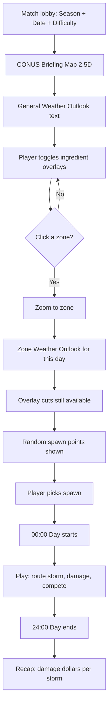

# United States Map & 10 Climate Zones

**Scope:** Continental U.S. play space, zone climates, seasons, briefing map, spawn flow.  
**Related:** [MapDesign.md](MapDesign.md), [StormSimulationVision.md](StormSimulationVision.md), [StormFeaturesImplementationPlan.md](StormFeaturesImplementationPlan.md) (M-phases), [DayCycleAndRecapDesign.md](DayCycleAndRecapDesign.md)

---

## Geographic scope

- **Playable map:** **Continental United States (CONUS)** — stylized but recognizable silhouette.  
- **Not required:** Alaska, Hawaii, or 1:1 cartographic survey accuracy.  
- **Includes:** State borders (subtle), **major interstates**, **settlements** (hamlet / town / city), terrain regions.  
- **Oceans / Gulf / Great Lakes:** Moisture and hurricane/tropical influence at margins.

The prototype’s single rectangle (`2560×1440`) evolves into a **CONUS-shaped playfield** with **10 weather zones** as simulation regions.

---

## Ten weather-based zones

Each zone is a **climate regime**, not just a biome paint bucket. Daily atmosphere seeds apply **zone baseline + season + day randomness**.

| ID | Zone name | Real-world anchor | Dominant storm flavors | Season notes |
|----|-----------|-------------------|------------------------|--------------|
| **Z01** | **Pacific Northwest** | WA, OR, coastal BC influence | Frontal rain, occasional severe; winter wind storms | Wet cool season; drier summer |
| **Z02** | **California Coast** | CA coast, Central Valley fringe | Dry summer; winter fronts; burn scar flash flood risk (future) | Mediterranean wet winter |
| **Z03** | **Desert Southwest** | AZ, NM, Mojave | Monsoon bursts, dry microbursts, dust | Summer monsoon peak |
| **Z04** | **Southern Plains** | TX, OK panhandle south | **Dryline**, supercells, hail, tornadoes | Spring peak severe |
| **Z05** | **Central Plains** | KS, NE, OK | Classic **Tornado Alley** supercells | Apr–Jun max CAPE/shear |
| **Z06** | **Gulf Coast** | LA, MS, AL, coastal TX | Tropical moisture, hurricanes, squall lines | Hurricane season + summer convection |
| **Z07** | **Southeast** | GA, Carolinas, interior FL | Air-mass storms, tropical remnants, QLCS | Long warm season |
| **Z08** | **Florida Peninsula** | FL | Sea-breeze storms, tropical systems, high PW | Year-round humidity; hurricane landfalls |
| **Z09** | **Great Lakes / Upper Midwest** | MN, WI, MI, IL north | Lake-effect snow (winter); summer MCS, derechos | Strong season swing |
| **Z10** | **Northeast / Mid-Atlantic** | NY, PA, NJ, New England | Nor’easters (winter), summer severe, coastal | Winter vs summer modes |

**Spawn rule:** Player may enter in **any** of the 10 zones for that day’s match.

**Zone data (per zone resource):**
- `zone_polygon` (CONUS space)
- `climate_baseline` — biases CAPE, Td, shear, PW by season
- `settlement_density` — towns/cities per zone
- `major_roads[]` — interstate segments for art + evacuation (agency later)
- `display_name`, `outlook_blurb_template`

---

## Seasons

**Season** modifies zone baselines when the daily atmosphere is seeded.

| Season | Months (Northern Hemisphere, simplified) | Global effects |
|--------|------------------------------------------|----------------|
| **Spring** | Mar–May | Rising CAPE, strong shear on Plains; tornado season ramp |
| **Summer** | Jun–Aug | Peak Gulf/SE humidity; monsoon SW; heat domes |
| **Fall** | Sep–Nov | Secondary severe; hurricane late season; cooler NW |
| **Winter** | Dec–Feb | Reduced CAPE most zones; lake-effect / nor’easter zones active |

**Match setup:** `season` + `calendar_day` + `daily_seed` → synoptic pattern.

Same zone plays differently in **March** vs **July**.

---

## Map presentation — briefing vs gameplay

### Briefing map (2D with 3D-like look)

**Not full 3D engine required for v1** — achieve “3D-like” via:

| Technique | Purpose |
|-----------|---------|
| **Heightmap extrusion / normal-lit tiles** | Terrain “pops” (Rockies, Appalachians, plains flat) |
| **Parallax layers** | Coast, hills, clouds drift slowly |
| **Extruded settlement markers** | Cities/towns cast subtle shadow |
| **Road emboss** | Major interstates readable on terrain |
| **Time-of-day grade** | Dawn briefing tint → noon play |

**Visible on CONUS view:**
- Terrain relief (stylized)
- **Cities, towns** (icon scale by tier)
- **Major roads only** (I-10, I-40, I-80, etc. — not every street)
- **10 zone outlines** (clickable)
- Optional: state borders

### Gameplay map

- Same underlying data; can simplify art while moving storm.  
- Full **S12** may add true 3D terrain; briefing can stay 2.5D.

---

## Briefing flow (player UX)

### Step 1 — CONUS briefing

- **General weather outlook** — 2–4 sentences (procedural from seed): e.g. “Moderate risk Central Plains; Gulf moisture surging north.”  
- **Difficulty badge** ([StormDifficultyDesign.md](StormDifficultyDesign.md)).  
- **Multiplayer — zone occupancy** (see below): live counts per zone before anyone spawns.

### Multiplayer briefing — zone occupancy (Storm + Agency)

During the **shared briefing window** (before **00:00**), every player sees **how crowded each zone is** so they can avoid or seek competition.

**Per zone on CONUS map** (badge on zone polygon or legend column):

| Faction | Shown as | Meaning |
|---------|----------|---------|
| **Storm — Human** | `Storm 👤 N` | Real players who **committed** to this zone for the day |
| **Storm — AI** | `Storm 🤖 N` | AI storm slots assigned to this zone |
| **Agency — Human** | `Agency 👤 N` | Real Weather Service players **committed** to this zone *(deferred role)* |
| **Agency — AI** | `Agency 🤖 N` | AI agency slots in this zone *(deferred role)* |

**Rules:**

1. **Commit moment:** Count increments when a player **locks zone choice** (enters zone zoom and confirms “Play this zone” **before** spawn pick). Spawn pick does not change zone; death respawn stays in same zone.  
2. **Live updates:** All clients receive occupancy deltas via match server during briefing ([MultiplayerDesign.md](MultiplayerDesign.md)).  
3. **Zone zoom:** Enlarged breakdown + short line: e.g. `Z05 — Storm 3👤 2🤖 · Agency 1👤 1🤖`.  
4. **Solo / AI backfill:** If humans &lt; lobby cap, show **AI** counts filling storm (and later agency) slots — players still see predicted ecosystem density.  
5. **No exact spawns revealed:** Only **zone-level** counts during briefing; enemy spawn dots appear **after** day start (or fog of war TBD).  
6. **Agency parity:** Same UI treatment for agency faction so storms see how much “opposition” is in a zone even before agency gameplay ships.

**Why it matters:** High storm 👤 in Z05 = ingredient competition; high agency 👤 = harder $ damage later (when agency exists).

**Solo:** Optional toggle to hide human column (always 0); AI counts still show.

### Step 2 — Ingredient overlay “cuts”

Player clicks tabs (one active at a time or blend slider):

| Tab ID | Shows | Threshold hint |
|--------|-------|----------------|
| `CAPE` | J/kg heatmap | Tier colors from [StormMeteorologyReference.md](StormMeteorologyReference.md) |
| `CIN` | Cap strength | Strong cap = needs boundary |
| `Td` | Dewpoint | Moisture corridors |
| `Temp` | Surface temperature | Instability with moisture |
| `PW` | Precipitable water | Heavy rain potential |
| `Shear` | Bulk 0–6 km | Supercell environments |
| `SRH` | 0–1 km SRH | Rotation risk |
| `Lift` | Fronts, dryline, boundaries | Triggers |
| `Severe` | Composite index (UI) | Quick “where to play” |

Educational tooltips link to [StormPlayerCheatSheet.md](StormPlayerCheatSheet.md).

### Step 3 — Zone select & zoom

- Click **one of 10 zones** → camera **zooms** to zone bounds.  
- **Zone occupancy panel** — Storm 👤/🤖 and Agency 👤/🤖 for this zone (multiplayer).  
- **Zone weather outlook** — localized text + same overlay cuts **clipped to zone**.  
- Highlights: best ingredient corridors, risky dry slots, settlement clusters.  
- **Confirm zone** → commits player to zone (updates global occupancy); then spawn step.

### Step 4 — Spawn selection

- System generates **N random spawn candidates** (e.g. 5–8) **inside the zone**, weighted by outlook:  
  - Higher weight near **lift + moisture + CAPE** corridors.  
  - Lower weight in poor air (still allowed on Easy for learning).  
- Player **clicks one** spawn → `spawn_zone_id` locked for the day; first position stored as `initial_spawn_position`.  
- **One active storm** per player at match start ([DayCycleAndRecapDesign.md](DayCycleAndRecapDesign.md)).  
- **On storm death:** regenerate spawn candidates **in the same `spawn_zone_id`** → player picks again (not forced to the first coordinates).

### Step 5 — Start day

- Clock **00:00** → gameplay. Player draws paths, grows storm, crosses zones if desired (ingredients deplete per region).

---

## Cross-zone travel

- Player is **not** locked inside spawn zone after start.  
- Traveling across CONUS consumes time on the **24-hour clock**.  
- Each zone’s **seasonal baseline** applies when storm enters that polygon.  
- Strategic goal: spawn where day outlook is strong **or** route toward exploding risk / rich settlements.

---

## AI on CONUS

- AI storms spawn in zones using same spawn rules (per difficulty).  
- Compete for ingredients and (D phase) destruction dollars.

---

## Implementation mapping

| Doc phase | Delivers |
|-----------|----------|
| **M1** | CONUS silhouette, 10 zone polygons, season tables |
| **M2** | Briefing 2.5D map + roads + settlements art |
| **M3** | Overlay cuts + outlook text generator |
| **M4** | Zone zoom UI + zone outlook |
| **M5** | Weighted random spawns + pick UI |
| **M7** | Multiplayer zone occupancy sync (Storm + Agency counts) |
| **S9** | Integrates M1–M7 into `GameManager` planning state |
| **MP1** | Full multiplayer briefing + lobby (with M7) |

---

## Document history

| Date | Note |
|------|------|
| 2026-05 | CONUS, 10 climate zones, seasons, 2.5D briefing, zone zoom spawns |
| 2026-05 | Multiplayer briefing: per-zone Storm/Agency human vs AI counts |
